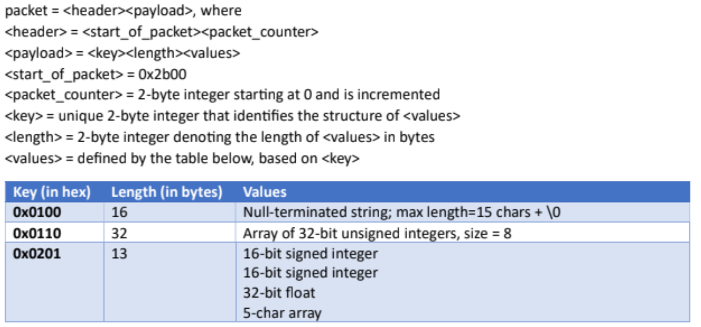

# packet-generation-consumption-app
This application will simulate the unpacking of data and commands received via serialized communications. 

# Problem statement
## Create an application that does the following:
- Create a thread that generates packets with random data that have the following structure: 
- Create a thread that will receive and process these packets
- Print the packet data to screen in a readable format
